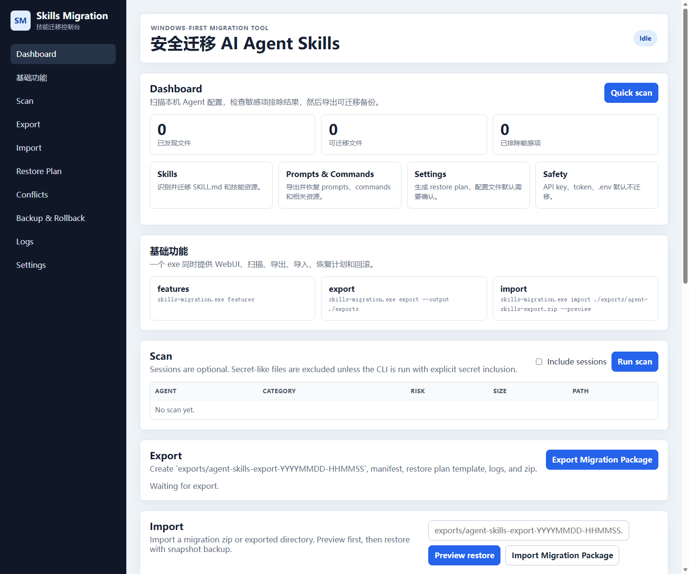

# Skills Migration

Skills Migration 是一个 Windows 优先、跨平台可扩展的 AI Agent Skills 迁移工具。它聚焦跨机器迁移闭环：在源机器扫描并导出迁移 zip，在目标机器导入、生成恢复计划、处理冲突、创建备份快照，并支持 rollback。

English summary: **Skills Migration** exports and restores AI coding agent skills, prompts, commands, settings, and related config files across machines.



## 当前目标

- 扫描 opencode、Hermes、Claude Code、Codex、OpenClaw、Cursor、Gemini CLI 的本地配置目录。
- 导出 skills、prompts、commands、settings、memories，以及普通配置文件类别。
- 默认跳过 secrets：`.env`、`*.pem`、`*.key`、`credentials.json`、`token.json`、`secrets.json`、含 `API_KEY` / `TOKEN` / `SECRET` / `PASSWORD` 的配置项。
- 生成可复制到另一台电脑的 zip 迁移包。
- 导入时校验 manifest 和 checksums。
- 导入前创建 `backups/YYYYMMDD-HHMMSS-before-restore/`。
- 生成 `restore_plan.json` 和 `restore_report.md`。
- 冲突文件默认 rename 为 `*_imported`。
- 支持 rollback 恢复导入前状态。

## 支持的 Agent

| Agent / Tool | Windows 扫描路径 | macOS / Linux 扫描路径 | 状态 |
| --- | --- | --- | --- |
| Codex | `%USERPROFILE%\.codex` | `~/.codex` | 已支持 |
| OpenClaw / `.agents` skills | `%USERPROFILE%\.agents` | `~/.agents` | 已支持 |
| Claude Code | `%USERPROFILE%\.claude` | `~/.claude` | 已支持 |
| opencode | `%APPDATA%\opencode`, `%LOCALAPPDATA%\opencode`, `%USERPROFILE%\.config\opencode` | `~/.config/opencode` | 已支持 |
| Hermes | `%USERPROFILE%\.hermes` | `~/.hermes` | 已支持 |
| Cursor | `%USERPROFILE%\.cursor` | `~/.cursor` | 已支持 |
| Gemini CLI | `%USERPROFILE%\.gemini` | `~/.gemini` | 已支持 |

识别类别：

- `skills`
- `agents`
- `commands`
- `prompts`
- `mcp_configs`，仅作为普通配置文件类别参与导出/导入，不做 MCP 产品级迁移或机器绑定
- `settings`
- `memories`
- `sessions`，默认不迁移，可选开启
- `secrets`，默认跳过

## 一键跨机器迁移

源机器导出：

```powershell
skills-migration.exe export --output ./exports
```

会生成：

```text
exports/agent-skills-export-YYYYMMDD-HHMMSS/
├─ manifest.json
├─ restore_plan.template.json
├─ agents/
│  ├─ opencode/
│  ├─ hermes/
│  ├─ claude/
│  └─ codex/
└─ logs/
   └─ export_report.md

exports/agent-skills-export-YYYYMMDD-HHMMSS.zip
```

把 zip 复制到目标机器，先预览：

```powershell
skills-migration.exe import ./agent-skills-export-YYYYMMDD-HHMMSS.zip --preview
```

确认后导入：

```powershell
skills-migration.exe import ./agent-skills-export-YYYYMMDD-HHMMSS.zip
```

回滚：

```powershell
skills-migration.exe rollback --snapshot backups/YYYYMMDD-HHMMSS-before-restore
```

兼容 npm bin 名：

```powershell
agent-migrator export --output ./exports
agent-migrator import ./agent-skills-export-YYYYMMDD-HHMMSS.zip
agent-migrator rollback --snapshot backups/YYYYMMDD-HHMMSS-before-restore
```

## 导入冲突策略

- `skills` / `prompts` / `commands` / `agents` / `memories`：默认 merge 到目标 agent 目录；同名文件冲突时写成 `*_imported`。
- `settings` / `unknown config`：默认不直接覆盖，写入 restore plan，标记为需要确认。
- `mcp_configs`：作为普通 JSON 配置文件处理；JSON 文件冲突时做 JSON merge，不做整文件覆盖。
- `secrets`：默认 skip。

## Windows 可运行包

构建：

```powershell
npm install
npm run package:win
```

输出：

```text
outputs\win-x64\skills-migration.exe
```

启动 WebUI：

```powershell
outputs\win-x64\skills-migration.exe web
```

查看基础功能：

```powershell
outputs\win-x64\skills-migration.exe features
```

## 本地开发

```powershell
npm install
npm run smoke
npm run typecheck
npm run dev
```

WebUI：

```text
http://localhost:5174
```

## WebUI 页面

- Scan
- Export
- Import
- Restore Plan
- Conflicts
- Backup & Rollback
- Logs

## Manifest

schema 文件：

```text
docs/manifest.schema.json
```

`manifest.json` 包含：

- `export_version`
- `created_at`
- `source_os`
- `source_hostname`
- `detected_agents`
- `categories`
- `file_count`
- `total_size`
- `checksums`
- `files[].original_path`
- `files[].portable_target_path`
- `skipped_sensitive_files`

## Smoke Test

```powershell
npm run smoke
```

测试覆盖：

1. 创建 fake opencode/hermes/claude/codex 配置目录。
2. 写入 fake skills/prompts/settings。
3. 执行 scan。
4. 执行 export。
5. 清空目标测试目录。
6. 执行 import。
7. 验证文件恢复成功。
8. 验证 `.env` / token / secret 文件被跳过。
9. 验证冲突文件被 rename。
10. 验证 rollback 可恢复导入前状态。

## 已知限制

- WebUI 的导入路径目前需要手动输入 zip 或导出目录路径，还没有系统文件选择器。
- settings/config 默认不覆盖，需要后续增加逐项确认 UI。
- MCP configs 只按普通配置文件处理，不负责安装 MCP server runtime、不做机器码绑定。
- GitHub 同步不是默认功能；建议只把已审计迁移包放到 private repo。
